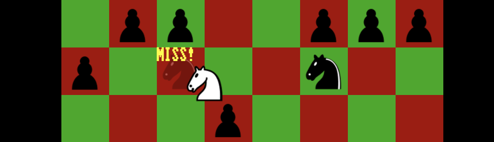

# *Rogess*

# [Play Online](https://pippinbarr.github.io/rogess) (desktop and mobile)

## Description
*e4! e5! Nf3! Nc6! White knight captures black pawn! Black knight attacks white knight for 2HP of damage! White knight misses black knight! What the hell is going on?!*

Created by [Jonathan Lessard](https://jonathanlessard.net) and [Pippin Barr](https://pippinbarr.com), *Rogess* is the shadow-sequel to [*Chogue*](https://github.com/pippinbarr/chogue/wiki/Press-Kit). Where *Chogue* set the game of chess in a series of *Rogue*-like procedurally-generated dungeons, *Rogess* takes the combat rules of *Rogue* and applies them to a standard game of chess. Essentially, *Rogess* answers a fairly simple "what if?" around the mechanics of chess and the spatial environment of *Rogue*. As with *Chogue*, this reconfiguration of both games leads to something new and odd and maybe, just maybe, kind of enjoyable.

## Press
Read the [Press kit](../press) for press information

## Documentation
* Read the [Process documentation](../process) for process journal, designer correspondence, related work, research questions, to-do lists, and closing statement
* Read the [Commit History](https://github.com/pippinbarr/rogess/commits/master) for step-by-step information about how the project was built
* Look at the [Code Repository](https://github.com/pippinbarr/rogess) for source code etc.

## Licsense
_Rogess_ is an open source game licensed under a [Creative Commons Attribution-NonCommercial 3.0 Unported License](http://creativecommons.org/licenses/by-nc/3.0/). You can obtain the source code from its [code repository](https://github.com/pippinbarr/rogess) on GitHub.
