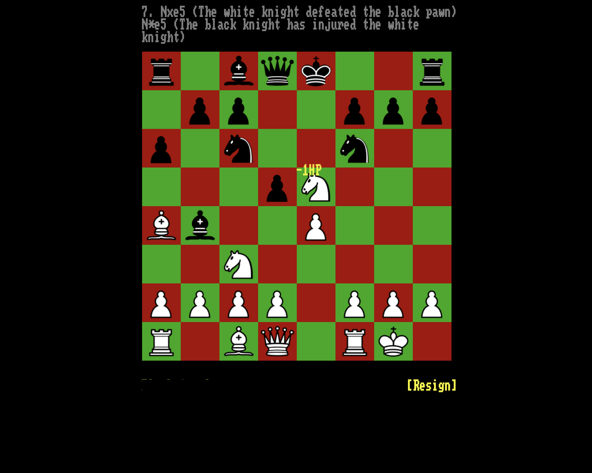

# _Rogess_ Press Kit

_e4! e5! Nf3! Nc6! White knight captures black pawn! Black knight attacks white knight for 2HP of damage! White knight misses black knight! What the hell is going on?!_

#### [Play _Rogess_ online](https://pippinbarr.github.io/rogess) (desktop and mobile)

## The basics

* Developers: [Jonathan Lessard](http://www.jonathanlessard.net/) and [Pippin Barr](http://www.pippinbarr.com/)
* Release: 21 May 2019
* Platform: Browser (desktop and mobile)
* Code repository: https://github.com/pippinbarr/rogess
* Price: $0.00

## Who are these guys?

Jonathan and Pippin are experimental game developers who have made games about everything from [Eurovision](http://www.pippinbarr.com/2012/03/27/epic-sax-game/) to [being a prophet](https://www.lablablab.net/?p=437) to the action-packed field of [academic game studies](http://www.pippinbarr.com/2016/07/06/game-studies/). They both work in the [Department of Design and Computation Arts](http://www.concordia.ca/finearts/design.html) at Concordia University in Montréal, where Jonathan is an Associate Professor and Pippin is an Assistant Professor. Jonathan runs [LabLabLab](https://www.lablablab.net/), a research lab focused on procedural conversation in videogames, while Pippin is the director of the [Technoculture, Art, and Games](http://tag.hexagram.ca/) (TAG) Research Centre, which is part of the [Milieux Institute for Arts, Culture, and Technology](http://milieux.concordia.ca/).

## Description

_Rogess_ is the shadow-sequel to [_Chogue_](https://github.com/pippinbarr/chogue/). Where _Chogue_ set the game of chess in a series of _Rogue_-like procedurally-generated dungeons, _Rogess_ takes the combat rules of _Rogue_ and applies them to a standard game of chess. Essentially, _Rogess_ answers a fairly simple "what if?" around the mechanics of chess and the spatial environment of _Rogue_. As with _Chogue_, this reconfiguration of bothh games leads to something new and odd and maybe, just maybe, kind of enjoyable.

## History

_Rogess_ started life as "Cherry Chogue", a version of the original _Chogue_ in which pieces had hit-points (HP) and attack power rather than every capture being instant and final. We discovered on playing this take on _Chogue_ that it was all too easy for the human player to best the computer AI by ignoring attacks and just charging through the dungeons with a single piece (most obviously a queen), suffering minimal casualties. We were disappointed, but eventually hit on the idea of setting this mechanic back on the original chess-board as a way to complicate the spatial relationships between pieces - with a much more "busy" environment, it's no longer possible to just side-step combat. We also moved to a more sophisticated AI algorithm (care of [Lauri Hartikka](https://medium.freecodecamp.org/simple-chess-ai-step-by-step-1d55a9266977)) that searches multiple moves ahead etc. (and modified it to account for the idea of HP). The resulting game is strange and comical and hopefully throws both source games into a new light for players to think about.

## Technology

_Rogess_ was created in JavaScript chiefly using [chess.js](https://github.com/jhlywa/chess.js) and [chessboard.js](https://chessboardjs.com/). It uses [jQuery](http://jquery.com/) and [jQuery UI](https://jqueryui.com/) for some manipulation of elements on the page, and a modified version of [Lauri Hartikka](https://medium.freecodecamp.org/simple-chess-ai-step-by-step-1d55a9266977)'s simple chess AI.

## License

_Rogess_ is an open source game licensed under a [Creative Commons Attribution-NonCommercial 3.0 Unported License](http://creativecommons.org/licenses/by-nc/3.0/). You can obtain the source code from its [code repository](https://github.com/pippinbarr/rogess) on GitHub.

## Features

- An overpowered king!
- Check but no checkmate!
- En passant!
- Standard chess openings probably not working!
- Did my queen just "miss" that pawn?!

## Images

## Press

- Coming soon?

## Additional Links

- [Process documentation of _Rogess_](https://github.com/pippinbarr/rogess/blob/master/process/README.md)
- [Commit history of _Let's Play: Ancient Greek Punishment: Chess Edition_](https://github.com/pippinbarr/lets-play-ancient-greek-punishment-chess-edition/commits/master)

## Credits

* Pippin Barr: code, design
* Jonathan Lessard: audio, design

## Contact

* Email: [pippin.barr+press@gmail.com](mailto:pippin.barr+press@gmail.com)
* Website: [jonathanlessard.net/](https://jonathanlessard.net/) / [www.pippinbarr.com](http://www.pippinbarr.com/)
* Twitter: [@GlandeurLessard](https://twitter.com/Glandeurlessard) / [@pippinbarr](https://www.twitter.com/pippinbarr)
