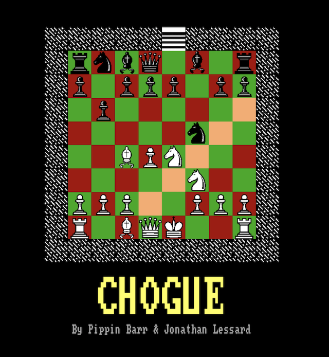
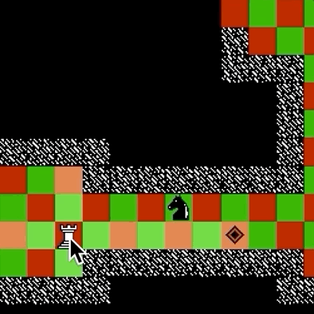
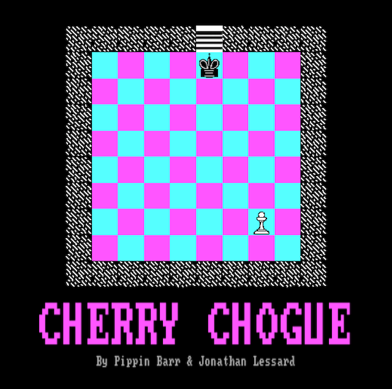
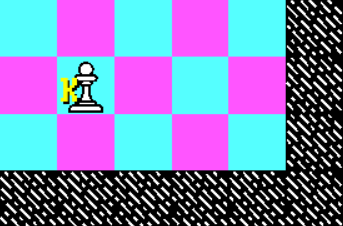
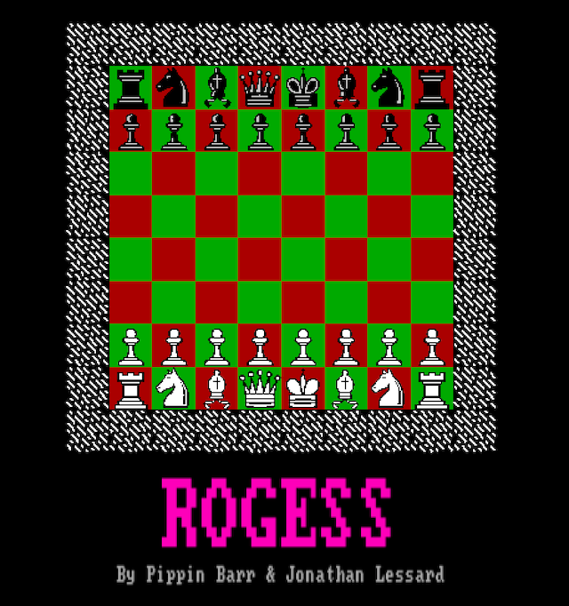
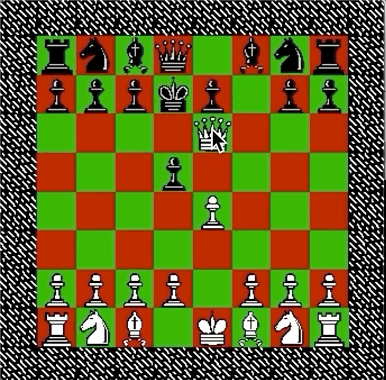
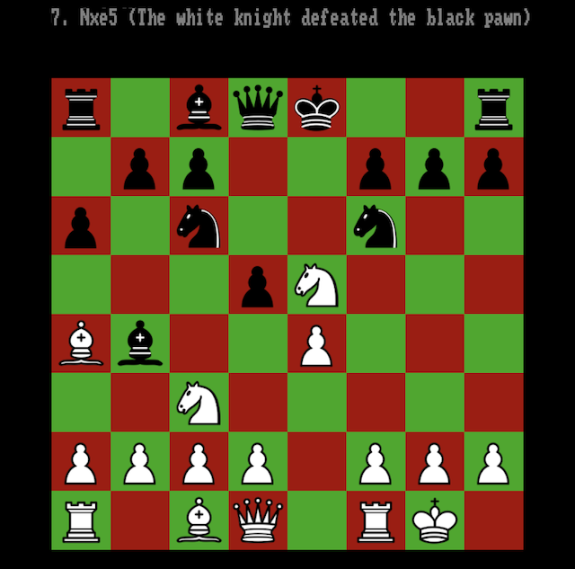
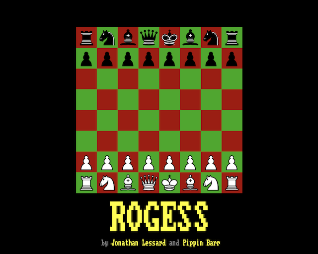

# Closing statement: From simplicity to complexity and back again: The design and development of Rogess

[Rogess](https://github.com/pippinbarr/rogess) (by [Jonathan Lessard](https://jonathanlessard.net/) and [Pippin Barr](http://pippinbarr.com/)) can be thought of as a kind of "sequel" to [Chogue](https://github.com/pippinbarr/chogue/wiki/Press-Kit). It's more accurate to say, though, that it is a game occupying the same design space as Chogue, representing a second data-point in our exploration of [hybrid game design](https://www.gamasutra.com/blogs/PippinBarr/20180612/319854/Chess__Rogue__Chogue_Some_notes_on_hybrid_game_design.php). In brief, with hybrid game design we're exploring the idea of taking two separate games and combining them by using "design decisions" selectively taken from one or the other game, then seeing what the result looks like.

(__Note__: throughout this text, I’ll be linking to process materials generated as part of the project in its [code repository](https://github.com/pippinbarr/rogess/blob/master/process/README.md). The links are both to the specific moments I added relevant code to the project and wrote notes about it - signified by the mysterious strings of letters and numbers known as "commit hashes" - and also to the email correspondence Jonathan and I conducted throughout. This approach to process documentation is part of the [Games as Research](https://gamesasresearch.com) project.)

  
_Chogue, the "prequel" to Rogess_

## "What if hit-points"?

Rogess began with the idea of a [basic tweak to Chogue's idea of combat](https://github.com/pippinbarr/rogess/blob/master/process/correspondence.md#chogue), replacing chess-style captures with _Rogue_-style hit-points (HP) and attacking moves that do damage. Jonathan was able to implement this relatively straightforwardly in the existing codebase for Chogue, refining to a simple checkbox for toggling between "chess mode" and "Rogue mode" ([dd7fcb2](https://github.com/pippinbarr/chogue/commit/dd7fcb2f51b464b1e8527a38aa1c167862889f1f)) and including the very pleasing idea of [using the chess pieces's traditional values as their starting HP](https://github.com/pippinbarr/rogess/blob/master/process/correspondence.md#pippin-to-jonathan-5-jun) (1 for a pawn, 3 for a knight, 5 for a rook, etc.).

  
_Chogue with HP-based attacks_

With a working prototype quickly in place, we were able to play the game - now essentially chess pieces in a dungeon environment who attack and are attacked for HP - and get a feel for it. [We discussed this initial feel extensively](https://github.com/pippinbarr/rogess/blob/master/process/correspondence.md#hitpoint-version), noting that it was less ridiculous than expected and in particular noting some of the comic value such as the pieces "bashing away at each other" (rather than being captured right away), or the terror of an opponent's queen arriving in your starting area and being impossible to immediately dispose of.

We also felt an immediate concern that the game would be too easy in this state - because the objective of Chogue is to reach level 13 and to capture the "King of Yendor", the HP-oriented version made it possible to explore rapidly with a high-HP piece (most obviously a queen) and to just ignore attacks from other pieces in a quest to descend levels as fast as possible, rather than falling prey to swift death in the dark.

_Moving through the world too easily_

At this point, though, the impending release of Chogue itself, which we wanted to keep separate from this new HP-version, meant we focused more on polishing that game before eventually returning to what we were calling "[Cherry Chogue](https://github.com/pippinbarr/rogess/blob/master/process/correspondence.md#jonathan-to-pippin-18-jun)" at the time.

## Difficulty, AI, and variants

Our anxiety about having made "Cherry Chogue" too easy quickly start expressing itself in various bids to alter the structure of the game to offset the new forms of play that hit-points allowing. This included the suggestion of simply [increasing the number of levels to traverse](https://github.com/pippinbarr/rogess/blob/master/process/correspondence.md#pippin-barr-sat-jun-23-2018-at-513-pm-to-jonathan-lessard) or [playing with a single piece as an avatar](https://github.com/pippinbarr/rogess/blob/master/process/correspondence.md#jonathan-lessardsat-jun-23-2018-at-1029-pm-to-pippin-barr). We were also thinking, here, of the larger question of the "purity" of the design, and whether we were interested in more extreme changes to the formula of Chogue, or whether we wanted to try incremental variations perhaps more in keeping with a (not very) "scientific method".

  
_Cherry Chogue with a single avatar_

In the end it was clear that only including the HP-variation [led to an unbalanced and trivial form of play](https://github.com/pippinbarr/rogess/blob/master/process/correspondence.md#pippin-barrthu-aug-16-2018-at-443-pm-to-jonathan-lessard) and Jonathan especially set to work on a [set of changes](https://github.com/pippinbarr/rogess/blob/master/process/correspondence.md#jonathan-lessardfri-aug-17-2018-at-225-pm-to-pippin-barr) around the idea of playing with a single piece to mitigate this while remaining the "dungeon exploration" format of Chogue, even implementing them in Unity ([30e70f6](https://github.com/pippinbarr/chogue/commit/30e70f6f610058d6e242391c65f272ba3059bf11)). Again, however, we ran into the issue that it was simply [too profitable to _avoid_ combat at all costs](https://github.com/pippinbarr/rogess/blob/master/process/correspondence.md#pippin-barrsun-aug-19-2018-at-513-pm-to-jonathan-lessard), despite it being arguably the most engaging activity in the game. We spun out further ideas, such as a slower levelling-up system, producing stronger enemies, or forcing the player to capture all enemies before continuing.

The idea of altering the opposition caught out fancy some time, centering on the idea of [reintroducing the Rogue enemies to the game](https://github.com/pippinbarr/rogess/blob/master/process/correspondence.md#jonathan-lessardsun-aug-19-2018-at-844-pm-to-pippin-barr), and then on creating hybrids such as a "Kestral Pawn" or a "Dire Queen". Jonathan went so far as to produce a visual prototype of this, with letters on pieces showing their "class" ([33f203b](https://github.com/pippinbarr/chogue/commit/33f203b97958baddfee8482224eaf601c6407f8a)).

  
_The "Kestral Pawn"_

It was at this moment that we hit the wall of having to [adjust to new parent parenting and returning to teaching at university](https://github.com/pippinbarr/rogess/blob/master/process/correspondence.md#jonathan-lessardsun-aug-26-2018-at-435-pm-to-pippin-barr). Progress slowed.

## The chessboard

When we returned to thinking about the game we had an (undocumented) meeting in which we revisited the various attempts we'd been making to increase the complexity of the Chogue system to counteract the impact of HP. We ended up deciding that in the interests of actually finishing the game and maintaining clarity in our process, we'd go in the other direction and simplify: we decided to set the game on a chessboard instead of in dungeons. We also decided to call it _ROGESS_ at that moment, given that it now seemed almost an "inversion" of Chogue in terms of space (from Rogue dungeons to a chessboard) and attacks (from chess captures to Rogue combat).

_ROGESS running in Unity_

Jonathan was able to quickly get a version working because we already had a chessboard level in Chogue ([c5c606b](https://github.com/pippinbarr/chogue/commit/c5c606bd8db9d1c315218321e85cd346e49dbdeb)) and we tried playing in this new scenario. Importantly, resetting the game on a chessboard hugely compresses the space and doesn't allow for combat avoidance anymore: both sides seek to capture the opponent's king on a highly limited playing field. In this way it's essentially chess, of course, but with the strange experience of "captures" involving your piece "pecking" at the other piece, sometimes missing, and only depleting its HP rather than outright defeating it.

  
_ROGESS with a weakling king_

It turns out this was surprisingly entertaining to play so long as you roughly follow chess wisdom, but [led to extremely easy victories](https://github.com/pippinbarr/rogess/blob/master/process/correspondence.md#jonathan-lessardfri-mar-22-2019-at-230-pm-to-pippin-barr) if you just targeted the opponent's king with your queen. The AI that was adequate for games of Chogue in sprawling dungeons with the cover of darkness turned out to be... [too stupid](https://github.com/pippinbarr/rogess/blob/master/process/correspondence.md#pippin-barrfri-mar-22-2019-at-319-pm-to-jonathan-lessard).

  
_ROGESS with a stronger king_

One small change we made in this sequence which was hugely important was the decision to [increase the king's HP](https://github.com/pippinbarr/rogess/blob/master/process/correspondence.md#pippin-barrfri-mar-22-2019-at-319-pm-to-jonathan-lessard) from 1 (our default assumption) to 10, making it the most powerful piece on the board and thus that much harder to defeat once you've targeted it. This didn't change the fact the AI was terrible at protecting its king, but [it did make the king hilariously robust](https://github.com/pippinbarr/rogess/blob/master/process/correspondence.md#jonathan-lessardfri-mar-22-2019-at-334-pm-to-pippin-barr).

## Wanted: A "Proper Chess AI"

It was clear that the Chogue AI wasn't able to cope with the complexities and interrelationships between pieces that exist on a chessboard. Our first response was to attempt to patch the AI with [various new sensible "chess-y" rules](https://github.com/pippinbarr/rogess/blob/master/process/correspondence.md#pippin-barrsat-mar-23-2019-at-416-pm-to-jonathan-lessard) that would help it play better, leading to [Jonathan announcing an implementation](https://github.com/pippinbarr/rogess/blob/master/process/correspondence.md#jonathan-lessardthu-apr-4-2019-at-240-pm-to-pippin-barr) a couple of days later ([ecd20d1](https://github.com/pippinbarr/chogue/commit/ecd20d11b817c2b4020c25d4fe2a1d428cfdc134)). The AI was significantly improved, but could still be fairly easily victimized by a human player.

During this process we'd run into an excellent [chess AI tutorial](https://www.freecodecamp.org/news/simple-chess-ai-step-by-step-1d55a9266977/) by Lauri Hartikka which used JavaScript and chess.js for its implementation and had led me to [plaintively bleat](https://github.com/pippinbarr/rogess/blob/master/process/correspondence.md#pippin-barrfri-apr-5-2019-at-953-am-to-jonathan-lessard) about wishing we had a "chess engine" underneath our game in order to take advantage of it. Jonathan pointed out that [Chogue's AI has quite extensive knowledge](https://github.com/pippinbarr/rogess/blob/master/process/correspondence.md#jonathan-lessardfri-apr-5-2019-at-1115-am-to-pippin-barr) of the game state and can be fairly sophisticated, but can never look beyond the current move choice.

## chess.js

Soon after this, and given that I'd been working with chess.js for [Let's Play: Ancient Greek Punishment: Chess Edition](https://pippinbarr.github.io/lets-play-ancient-greek-punishment-chess-edition/), I suggested I could try to get a [prototype of Rogess up using that technology](https://github.com/pippinbarr/rogess/blob/master/process/correspondence.md#rogess-1) instead as a way to make headway on the AI via the tutorial. Indeed it was relatively straightforward to do, and I had a prototype going with 1HP damage per attack fairly swiftly ([email](https://github.com/pippinbarr/rogess/blob/master/process/correspondence.md#pippin-barrfri-apr-12-2019-at-545-pm-to-jonathan-lessard), [aa26516](https://github.com/pippinbarr/rogess/commit/aa26516e362a2d1d2b0ec07ae592335456ca48a3)), and then a more or less "feature complete" version with the original damage model after that ([email](https://github.com/pippinbarr/rogess/blob/master/process/correspondence.md#pippin-barrsun-apr-14-2019-at-531-pm-to-jonathan-lessard), [bef6eb8](https://github.com/pippinbarr/rogess/commit/bef6eb8f151a792cb147dc7308bfcc5f3251a4c6)). Crucially, this version with an AI that could search to a depth of 3 or so was able to more accurately play "real looking" chess, and [wasn't as susceptible to trickery](https://github.com/pippinbarr/rogess/blob/master/process/correspondence.md#pippin-barrsun-apr-14-2019-at-534-pm-to-jonathan-lessard).

  
_Rogess looking like real chess_

Although we ended up with [some misgivings](https://github.com/pippinbarr/rogess/blob/master/process/correspondence.md#jonathan-lessardtue-apr-16-2019-at-1035-am-to-pippin-barr) about how extremely simple this hybrid had turned out to be (essentially just chess with Rogue combat), we decided to go ahead with it and to think of the simplicity as providing a formal object of study - back to the idea of an almost scientific change to one variable (combat) within a game while maintaining the rest of the game the same (chess). This led to a largely feature-complete version which we could contemplate ([a69de76](https://github.com/pippinbarr/rogess/commit/a69de7675b52c989709e2fbaaf41ca4fa9dae8b1)).

## Final battles

With the game implemented using purpose-made chess libraries (chess.js and chessboard.js), development was generally far more straightforward, but nonetheless there were the usual problems. Along with another brief feint toward complicated the system (this time with [leveling up and experience points (XP)](https://github.com/pippinbarr/rogess/blob/master/process/correspondence.md#pippin-barrthu-apr-18-2019-at-227-pm-to-jonathan-lessard)), the biggest issues here were getting the AI system to [recognize the importance of HP](https://github.com/pippinbarr/rogess/blob/master/process/correspondence.md#pippin-barr-mon-may-6-424-pm-to-jonathan) while calculating the value of moves, and tweaking it to adequately protect its own king and attack the player's. Eventually these things did get ironed out, though largely through unskillful brute force on my part ([395e2d0](https://github.com/pippinbarr/rogess/commit/395e2d034d8706e69be6916242e488b6d908cccc)).

  
_Finished!_

In the end, Rogess went from extreme simplicity (adjusting Chogue to use Rogue-style attacks) to complexity (systems involving XP, or solo avatar pieces, or Rogue-style enemies) and ultimately back to simplicity again (chess with Rogue-style attacks). As is often the case in game design and development, more or less none of this journey is visible in the final product, which might as well have just sprung fully-formed from our heads. Knowing that wasn't that case is, we think, the central part to understanding how the process really functions. It's only in seeing the ongoing decisions, misgivings, revisions, and excitement that we can get to grips with what is truly guiding this mysterious thing called game design.
